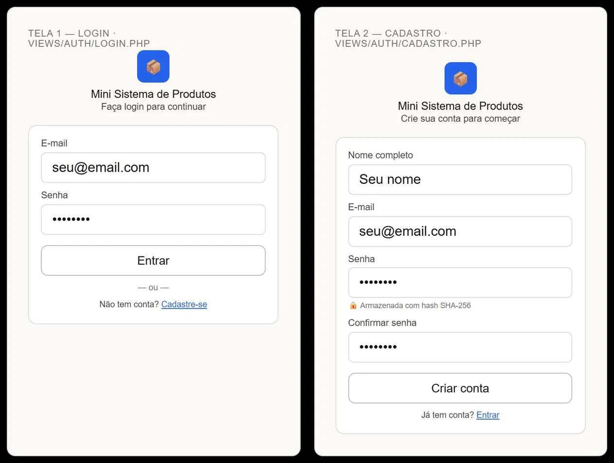
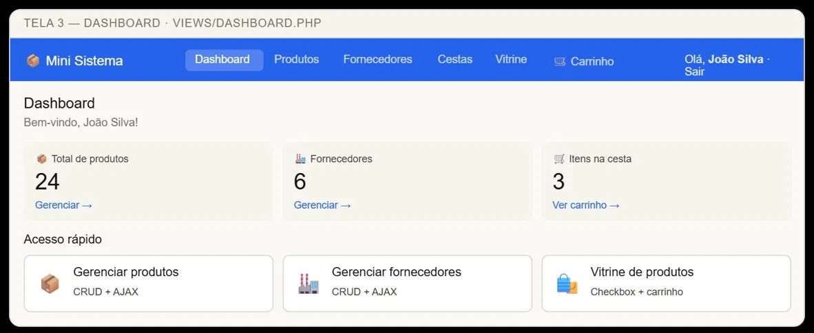
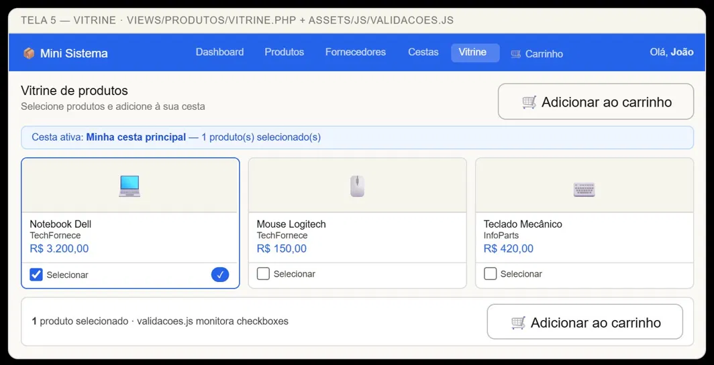
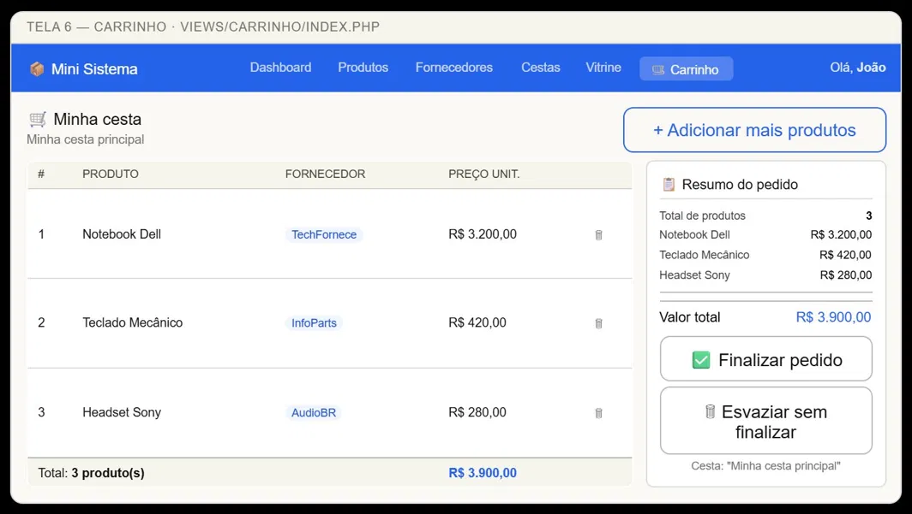
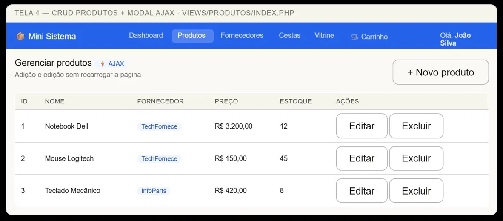
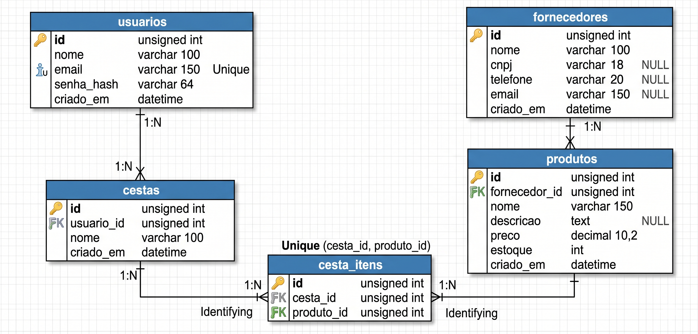

# Mini Sistema de Gestão de Produtos

> Sistema web para gestão de produtos, fornecedores e cestas.
> Desenvolvido com PHP, MySQL (PDO), Bootstrap e JavaScript (AJAX).

## Integrantes

|        Nome      |    RA    |
|------------------|----------|
| Vinicius Cordeiro| 60002252 |

## Funcionalidades

- Cadastro e autenticação de usuários (hash SHA-256)
- CRUD completo de Produtos, Fornecedores e Cestas
- Atualização via AJAX (sem reload de página)
- Vitrine de produtos com seleção por checkbox
- Carrinho de compras com resumo e valor total

## Como rodar o projeto

### Pré-requisitos
- PHP 8.1+
- MySQL 8.0+
- Servidor local: XAMPP, Laragon ou similar

### Passos
1. Clone o repositório:
   git clone https://github.com/seu-usuario/mini-sistema-produtos.git
2. Inicie o Apache e o MySQL no seu servidor local
3. Acesse http://localhost/mini_sistema_produtos ou htt
p://localhost:8080
4. O banco de dados e as tabelas são criados automaticamente no primeiro acesso

## Esboços de Tela (Figma)

## Diagrama Entidade-Relacionamento

## Tecnologias

- PHP 8.1 (sem frameworks)
- MySQL 8.0 com PDO
- HTML5 + CSS3
- Bootstrap 5
- JavaScript ES6+ (AJAX com Fetch API)